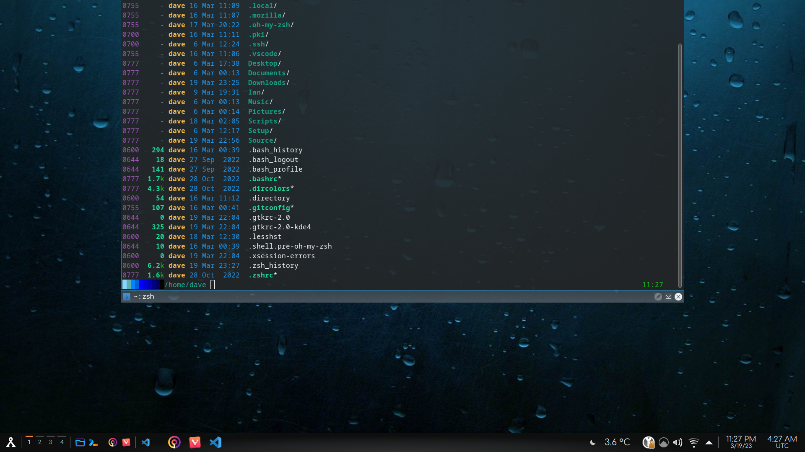

- [1) Introduction](#1-introduction)
  - [Latest Information](#latest-information)
    - [Fedora 40](#fedora-40)
    - [KDE 6](#kde-6)
  - [Other Fedora options](#other-fedora-options)
  - [Fedora Magazine](#fedora-magazine)
- [2) Installation](#2-installation)
  - [Installation Scripts](#installation-scripts)
- [3) Shells](#3-shells)
    - [Eza Colors](#eza-colors)
  - [Zsh](#zsh)
    - [Zsh Tweaks](#zsh-tweaks)
    - [Themes](#themes)
  - [Bash](#bash)
- [4) DNF \& Repositories](#4-dnf--repositories)
  - [DNF Options](#dnf-options)
  - [RPM Fusion](#rpm-fusion)
  - [Customizing the Repo List](#customizing-the-repo-list)
  - [DNF Running Slow](#dnf-running-slow)
  - [Groups](#groups)
  - [Installing Additional Desktop Environments](#installing-additional-desktop-environments)
  - [COPR](#copr)
- [5) My Fedora KDE settings \& tweaks](#5-my-fedora-kde-settings--tweaks)
  - [Backup \& Restore](#backup--restore)
  - [Changing The Volume Name](#changing-the-volume-name)
  - [Konsole](#konsole)
  - [Dolphin](#dolphin)
  - [KDE System Settings](#kde-system-settings)
    - [Startup/SDDM](#startupsddm)
    - [Appearance](#appearance)
    - [KDE Taskbar](#kde-taskbar)
    - [KDE Desktop Effects](#kde-desktop-effects)
    - [KDE Splash Screen](#kde-splash-screen)
    - [KDE Filetype Icons](#kde-filetype-icons)
  - [Multiple Desktops](#multiple-desktops)
- [6) Apps \& Packages I'd Recommend](#6-apps--packages-id-recommend)
  - [Yakuake](#yakuake)
  - [Visual Studio Code](#visual-studio-code)
    - [Using the Microsoft repository](#using-the-microsoft-repository)
    - [Using a Flatpak](#using-a-flatpak)
  - [Microsoft Open Fonts](#microsoft-open-fonts)
  - [OneDrive](#onedrive)
  - [Other Apps](#other-apps)
- [7) Additional Software Installers](#7-additional-software-installers)
  - [Fedy](#fedy)
  - [DNF Dragora](#dnf-dragora)
  - [Flatpaks](#flatpaks)
- [8) Other System Topics](#8-other-system-topics)
  - [SSH](#ssh)
  - [Backups](#backups)
  - [VPN](#vpn)
  - [Laptop Power Management](#laptop-power-management)
- [9) SELinux](#9-selinux)
- [10) Grub](#10-grub)
  - [Grub Configuration Files](#grub-configuration-files)
  - [Themes](#themes-1)
- [11) Plymouth](#11-plymouth)
- [12 Upgrades and Beta versions](#12-upgrades-and-beta-versions)
  - [RPM Fusion](#rpm-fusion-1)
  - [Upgrading Fedora](#upgrading-fedora)
- [13) Little Tips \& Tricks](#13-little-tips--tricks)
  - [Updating Apps](#updating-apps)
- [14) KDE Development](#14-kde-development)
- [15) Ham Radio](#15-ham-radio)


<br>

<a name="intro"></a>

# 1) Introduction

I've run Fedora since Fedora 9. It's my choice for a Linux OS for a number of reasons. When I first started with Linux my college used Scientific Linux, based on CentOS which itself is based on RedHat. Other students used Ubuntu, but I found it difficult to use since the development tools & other things don't match. Think Ubuntu's Build Essentials vs Fedora's Development Tools group. Everything I did on my machine matched what was used on the servers.  

Also, I just like the way Fedora does things. It may seem more complicated that Ubuntu but it gave me the opportunity to learn much more about what's happening inside. Linus Torvalis uses Fedora. The prosecution rests. 😎

I've spent a lot of time just playing with Fedora and KDE, learning how it works. KDE is very configurable. You can pretty much set it up however you want. 

As I find more I'll add it. I hope it helps you. 
<br><br>

## Latest Information

### Fedora 40

Fedora 40 Beta is now out for testing.

Fedora has decided to drop X11 support for Fedora 40 KDE. [Linuxiac](https://linuxiac.com/fedora-40-to-offer-plasma-6-drops-x11-entirely/) has a nice writeup on it with a link to the offical Fedora Wiki.

### KDE 6
KDE announced the release of KDE 6, and one of the most requested features is back: the Cube. I'll definitely be enabling that. KDE 6 has a LOT of new features and it's in Fedora 40.
<br><br>

## Other Fedora options

The primary Fedora release comes with the GNOME desktop environment. Fedora also releases 'spins' and 'labs'. Spins are distros focused on a desktop environment; e.g. KDE, LXDE, i3. Spins can be found [here](https://spins.fedoraproject.org/). Fedora Labs are distros designed for a specific purpose. These include

* [Astronomy](https://labs.fedoraproject.org/en/astronomy/)
* [Comp Neuro](https://labs.fedoraproject.org/en/comp-neuro/) for computational modelling tools for neuroscience
* [Design Suite](https://labs.fedoraproject.org/en/design-suite/) for multimedia production & design
* [Games](https://labs.fedoraproject.org/en/games/)
* [Jam](https://labs.fedoraproject.org/en/games/) for music production
* [Python Classroom](https://labs.fedoraproject.org/en/python-classroom/)
* [Security Lab](https://labs.fedoraproject.org/en/security/)
* [Robotics Suite](https://labs.fedoraproject.org/en/robotics/)
* [Scientific](https://labs.fedoraproject.org/en/scientific/)
<br><br>

## Fedora Magazine
[Fedora Magazine](https://fedoramagazine.org/) has a lot of good information. They'll post articles on how-tos and new apps to try.
<br><br>

<a name="install"></a>

# 2) Installation

* Download the Fedora KDE Spin [https://spins.fedoraproject.org/en/kde/](https://spins.fedoraproject.org/en/kde/)
<br>

* Import Fedora's GPG key(s) <br>
```
curl https://getfedora.org/static/fedora.gpg | gpg --import
```

* Verify the checksum is valid <br>
```
gpg --verify-files CHECKSUM_FILENAME
```

* Verify the download's checksum matches <br>
```
sha256sum -c CHECKSUM_FILE
```

Unless I'm installing Fedora in a VM I ***always*** encrypt the drive. I use the standard install options and leave the root user disabled. Obviously if you need a specific partition layout set it up here. I'd be wary of playing with it for the sake of playing with it. The Fedora engineers have done a great job of optimizing everything for the desktop and it would be very easy to *optimize* your system so it runs worse. I used to make the swap partition larger but there was no need for it. Enlarge it if you want to be able to hibernate. 

Fedora uses the Btvfs file system instead of Ext4. I'd leave it alone. There are discussions and/or arguments all over the web about the problems & benefits of Btvfs but like for partitioning, you're best just to leave it alone.

The Fedora installer looks different depending on what spin you're installing. For example, the KDE Spin has you setup the user account before installing while the standard Fedora installation (Gnome) has you creating the user after installing. I'm not sure why.

After installing Fedora you'll want to update everything before adding to your system. See the [DNF](#dnf) section for more information. 

```
sudo dnf update -y
```

The '-y' parameter suppresses the 'yes/no' prompts. It can be disabled in ```\etc\dnf\dnf.cfg``` by adding ```assume_yes=True``` but that's not a good idea. I only use <code>-y</code> for updates.

## Installation Scripts
I have my post-installation scripts & config files in the Files directory. 
<br><br>

<a name="shells"></a>

# 3) Shells

I switched to **<code>eza</code>** to replace **<code>ls</code>**. See [https://github.com/eza-community/eza](https://github.com/eza-community/eza) for more information. It formats things really well.

```
alias ls='eza -lao --group-directories-first --no-permissions --time-style "+%m/%d/%y %H:%M" --git'
```
Many of the switches are straight from **<code>ls</code>** but there are a few new ones.

-l : Long directory format<br>
-a : All files & directories, including . and ..<br>
-o : Octal permissions<br>
--group-directories-first<br>
--no-permissions : This one removes the standard wide permissions column<br>
--time-style : Allows you to format the time & date column<br>
--git : Adds the git status for each file
<br>

### Eza Colors
There's a very good man page on ArchLinux [https://man.archlinux.org/man/eza_colors.5.en](https://man.archlinux.org/man/eza_colors.5.en) that documents how to set various colors. I changed two<br>
```
export EZA_COLORS="di=33:da=36"
```

*di* sets the directory color<br>
*da* sets the date color

<br>


<a name="zsh"></a>

## Zsh
I use Zsh but still have Bash configured on my system. Zsh gives you a LOT of features over what Bash has. Read more at [https://zsh.sourceforge.io/Intro/intro_toc.html](https://zsh.sourceforge.io/Intro/intro_toc.html)

I also recommend Oh-My-Zsh. It adds lots of features that will make your life easier, along with themes. Check it out at [https://github.com/ohmyzsh/ohmyzsh](https://github.com/ohmyzsh/ohmyzsh)

To install Oh-My-Zsh
```
sh -c "$(curl -fsSL https://raw.github.com/ohmyzsh/ohmyzsh/master/tools/install.sh)"
```

It will create ```~/.oh-my-zsh/``` in your home directory. Themes are in ```~/.oh-my-zsh/themes```.
<br>

<a name="zsh-themes"></a>
### Zsh Tweaks

OhMyZsh left those ```zcompdump``` files all over my home directory. Open ```./oh-my-zsh/oh-my-zsh.sh``` and look 
for the line

```
ZSH_COMPDUMP="${ZDOTDIR:-$HOME}/.zcompdump-${SHORT_HOST}-${ZSH_VERSION}"
```

and change it to something like this. (I put mine in .config)

```
ZSH_COMPDUMP="${ZDOTDIR:-$HOME}/.config/.zcompdump-${SHORT_HOST}-${ZSH_VERSION}"
```

### Themes

Oh-My-Zsh has many themes you can try out. I took a theme and modified it to. Other than using an installed theme that's probably the easiest route. Theme building can get complicated.

[This page has a lot of information on zsh themes](https://github.com/ohmyzsh/ohmyzsh/wiki/Themes)

My theme is based on the nanotech.zshtheme found in <code>~/.oh-my.zsh/themes</code>.

```
  bar1() {    
      BAR_FG="048"    
      BAR1_BG="117  "  
      echo "%{$FG[$BAR_FG]%}%{$BG[$BAR1_BG]%} "    
  }    
  bar2() {    
      BAR_FG="048"    
      BAR1_BG="073"    
      echo "%{$FG[$BAR_FG]%}%{$BG[$BAR1_BG]%} "    
  }    
  bar3() {    
      BAR_FG="048"    
      BAR1_BG="033"    
      echo "%{$FG[$BAR_FG]%}%{$BG[$BAR1_BG]%} "    
  }    
  bar4() {    
      BAR_FG="048"    
      BAR1_BG="026"    
      echo "%{$FG[$BAR_FG]%}%{$BG[$BAR1_BG]%} "    
  }    
  bar5() {    
      BAR_FG="048"    
      BAR1_BG="021"    
      echo "%{$FG[$BAR_FG]%}%{$BG[$BAR1_BG]%} "    
  }    
  bar6() {    
      BAR_FG="048"    
      BAR1_BG="020"    
      echo "%{$FG[$BAR_FG]%}%{$BG[$BAR1_BG]%} "
  } 
  bar7() {    
      BAR_FG="048"    
      BAR1_BG="019"    
      echo "%{$FG[$BAR_FG]%}%{$BG[$BAR1_BG]%} "    
  }    
  bar8() {    
      BAR_FG="048"    
      BAR1_BG="018"    
      echo "%{$FG[$BAR_FG]%}%{$BG[$BAR1_BG]%} "    
  }    
  bar9() {    
      BAR_FG="048"    
      BAR1_BG="017"    
      echo "%{$FG[$BAR_FG]%}%{$BG[$BAR1_BG]%} "    
  }    
  bar10() {    
      BAR_FG="048"    
      BAR1_BG="016"    
      echo "%{$FG[$BAR_FG]%}%{$BG[$BAR1_BG]%} "    
  }    

  COLOR_BAR="$(bar1)$(bar2)$(bar3)$(bar4)$(bar5)$(bar6)$(bar7)$(bar8)$(bar9)$(bar10)"**  

  PROMPT='${COLOR_BAR}%d %F{green}%F{yellow}%f**'  
  RPROMPT='$(git_prompt_info) %F{green}%D{%L:%M}** '  
  
  ZSH_THEME_GIT_PROMPT_PREFIX="%B%F{green}"     
  ZSH_THEME_GIT_PROMPT_SUFFIX="%f"    
  ZSH_THEME_GIT_PROMPT_DIRTY=" %F{red}*%f"    
  ZSH_THEME_GIT_PROMPT_CLEAN=""    

```
And looks like this on a black background.


<a name="bash"></a>

## Bash

Here's the prompt for my colored bar in Bash

```
# Definitions for the color variant bar in the prompt. Doesn't have anything for Git.

  BAR1="\\[\e[48;5;117m\] "  
  BAR2="\\[\e[48;5;73m\] "  
  BAR3="\\[\e[48;5;33m\] "  
  BAR4="\\[\e[48;5;26m\] "  
  BAR5="\\[\e[48;5;21m\] "  
  BAR6="\\[\e[48;5;20m\] "  
  BAR7="\\[\e[48;5;19m\] "  
  BAR8="\\[\e[48;5;18m\] "  
  BAR9="\\[\e[48;5;17m\] "  
  BAR10="\\[\e[48;5;16m\] " 
  CLEAR="\\[\e[0m\]" 
  GREEN="\\[\e[1;32m\]" 
  YELLOW="\\[\e[1;33m\]" 
  PURPLE="\\[\e[1;35m\]" 

  # I removed the code to set the titlebar.  I'm good w/it just saying 'Konsole' or whatever  
  PS1="${BAR1}${BAR2}${BAR3}${BAR4}${BAR5}${BAR6}${BAR7}${BAR8}${BAR9}${BAR10}${CLEAR}${YELLOW}\${PWD} ${GREEN}\$ ${CLEAR}"  

```
and looks like this. 


<br>
<br>

<a name="dnf"></a>

# 4) DNF & Repositories
<a name="dnf-config"></a>

There are many options for DNF from getting through proxies, security settings, and more. Look at the official [Fedora DNF Reference](https://docs.fedoraproject.org/en-US/fedora/latest/system-administrators-guide/package-management/DNF/), the [Fedora DNF Quickdocs](https://docs.fedoraproject.org/en-US/quick-docs/dnf/) and the [DNF GitHub page](https://github.com/rpm-software-management/dnf) for more information.

## DNF Options
I use three options for dnf, set in <code>/etc/dnf/dnf.conf</code>.

```
fastestmirror=1
deltarpm=true
max_parallel_downloads=10
```
The default setting for <code>fastestmirror</code> is off. I have read some people reported dnf actually running slower with this enabled. I haven't noticed anything but keep it in mind.<br><br>
<code>deltarpm=true</code> allows dnf to save bandwidth by just downloading deltas instead of the entire package.<br><br>
<code>max_parallel_downloads=10</code> seems to give good performance.

I also use the -y parameter to suppress the 'Are you sure' messages when running an update.<br>

```
sudo dnf -y update
```
You can set this in <code>/etc/dnf/dnf.conf</code> by using <code>assumeyes=1</code> but I'd advise against it. I use -y for running updates but not to install individual packages so I can see what's actually getting installed.<br><br>
For more information on configuring dnf see https://www.systutorials.com/docs/linux/man/5-dnf.conf/


<a name="rpmfusion"></a>

## RPM Fusion
You'll probably want to enable RPM Fusion. RPM Fusion is a repository that contains software that doesn't meet the Fedora licensing. The base Fedora distro is FOSS-Only.

It can be installed from here. [https://rpmfusion.org](https://rpmfusion.org)

You can install it from your browser but I think it's easier to do it from the command line.

```
sudo dnf install https://mirrors.rpmfusion.org/free/fedora/rpmfusion-free-release-$(rpm -E %fedora).noarch.rpm https://mirrors.rpmfusion.org/nonfree/fedora/rpmfusion-nonfree-release-$(rpm -E %fedora).noarch.rpm
```

<a name="custom-repo-list"></a>

## Customizing the Repo List
Fedora's repository files are located in <code>/etc/yum.repos.d</code>. This is a section of a .repo. There can be other sections, like for debug or source packages. These are usually disabled.

```
[fedora]
name=Fedora $releasever - $basearch
metalink=https://mirrors.fedoraproject.org/metalink?repo=fedora-$releasever&arch=$basearch
enabled=1
countme=1
metadata_expire=7d
repo_gpgcheck=0
type=rpm
gpgcheck=1
gpgkey=file:///etc/pki/rpm-gpg/RPM-GPG-KEY-fedora-$releasever-$basearch
skip_if_unavailable=False
```

Fedora's Repository Docs are here - [https://docs.fedoraproject.org/en-US/quick-docs/repositories/](https://docs.fedoraproject.org/en-US/quick-docs/repositories/)


To change what the repo looks like when running dnf change the 2nd line of the .repo file.

The entries will look like this

```
name=Fedora $releasever - $basearch
```
<br>
You can change them to something like this so the repo names and architecture are in columns.  

```
Fedora $releasever              - $basearch
name=Fedora $releasever Updates - $basearch
```
<br>
Or remove the architecture altogether

```
Fedora $releasever
name=Fedora $releasever
```

If you want them in order, rename each repo file; e.g.

```
01-Fedora.repo 
02-Fedora-updates.repo
```
to make it look like this

<br>

## DNF Running Slow

DNF can take a long to update itself because it downloads the repository data often. A [discussion](https://ask.fedoraproject.org/t/why-is-dnf-so-slow/6316) on the Fedora Project site suggested setting <code>metadata_expire=2d</code> in <code>/etc/dnf/dnf.conf</code>. 

If you use the -q parameter (quiet) like in my install scripts it can look like the process hangs. 

I noticed that not all repositories I installed had the <code>metadata_expire</code> set. I went through all my .repo files and set them all to **1d**. That seems to have fixed it.

It appears that if you run dnf with the ```--refresh``` option it updates the repository data much faster than if you let Fedora handle it. I'm not sure why, it just seems that way. 

## Groups

There are a lot of dnf groups to choose from. See a list of groups by running 
```
dnf group list
```
You can get the short names for each group - useful if you're using batch files to install them - by running dnf with the -v (verbose) option. It will also tell you the metadata date/time for each repo.

```
dnf -v group list
```
```
...
repo: using cache for: fedora
fedora: using metadata from Sat 05 Nov 2022 03:04:38 AM CDT.
repo: using cache for: updates
updates: using metadata from Fri 17 Mar 2023 11:49:31 PM CDT.
repo: using cache for: fedora-modular
...

...
Network Servers (network-server)
Neuron Modelling Simulators (neuron-modelling-simulators)
Office/Productivity (office)
Python Classroom (python-classroom)
Python Science (python-science)
Robotics (robotics-suite)
...
```

You can see what's in each group by running <code>dnf group info GROUP_NAME</code>. I generally install *Development Tools* and *X Software Development* but take a look at the ones that sound like they might fit your needs. <br><br>

## Installing Additional Desktop Environments

Groups are by far the easiest way to install the big desktop environments. For example, if for some unknown reason you wanted to install Gnome 😎 you'd use
```
sudo dnf -y group install @gnome-desktop
```

(IMHO Gnome looks like what you'd get if Crayola wrote a window manager) 😎

Smaller DE's are just installed as packages; e.g. 
```
sudo dnf install fluxbox
```


Installing the appstream packages with dnf will enable showing apps from those repos in Discover.
```
appstream
appstream-qt
rpmfusion-free-appstream-data
rpmfusion-nonfree-appstream-data
```

Many of the options in dnf are actually plugins. You can install additional plugins, like the one you'll need for updating Fedora itself. See the plugins section at [https://docs.fedoraproject.org/en-US/quick-docs/dnf/](https://docs.fedoraproject.org/en-US/quick-docs/dnf/)

## COPR
If you want something other than what's in the Fedora & RPM Fusion repos, check out Fedora's COPR (COmmunity PRojects) repositories. They're user-created repos with their projects. <br><br>
I use one COPR repo for one of my ham radio apps that isn't available in the Fedora or RPM repos.<br><br>
There are nightly builds of software as well. Some of them are personal repos and say 'do not use'. Don't use them. 😎

[https://copr.fedorainfracloud.org/coprs/](https://copr.fedorainfracloud.org/coprs/)
<br><br>


<a name="various-kde-settings"></a>

# 5) My Fedora KDE settings & tweaks

## Backup & Restore

I haven't found a reliable way to restore all of my KDE settings when installing a new Fedora build. If you back up
./local & ./config that will take care of your personal settings but it will miss anything installed as the superuser. 
All of that lives down in /usr. I'll keep trying until I get it right.
<br><br>

<a name="change-volume-name"></a>

## Changing The Volume Name

Launch KDE Disk Editor from the Live CD. Rename your home volume to whatever you want. You can't change the name of a volume when booting from it. If your disk is encrypted you'll have to unlock it first. I just reboot back into the USB drive right after installing Fedora & do it then.
<br><br>

<a name="konsole"></a>

## Konsole

* General - Uncheck 'Remember window size'
* Profiles - You can't edit the Default profile so create a new one. I use a 90x24 window size. Under Command change it to /bin/zsh. Konsole will use the shell specified here and *not* the default shell for your account
* Under Appearance, I use White on Black, then press Edit and change Background transparency to 10%. I also bump the font up a bit.
* Scrolling to Unlimited


Set your new profile to the default profile. Then I disable all of toolbars under the Konsole Settings menu and hide the Menubar. Make sure you exit the Konsole session or it may not save your profile properly.
<br><br>

<a name="dolphin"></a>

## Dolphin
I remove all of the 'search for' categories on the left. I also hide the boot partition. Then I add what I need to 'Places'.

I setup Dolphin like this: In Settings<br>
* General/Behavior - Remember display style for each folder. This is handy for making the icons larger in folders with images, etc.
* General/Previews - Select the types you want displayed. I generally turn off everything but images & ebooks
* Context Menu - take everything out I don't need or want. There are additional services you can download. 

To change the icons for file types, go into System Settings/Applications and create a file type for what you want. For example, I created a type Text/x-shell, set the icon, and added .bashrc, .zshrc, etc. as filename patterns.

When you set icons for folders it does not change the small icon in the Dolphin 'Places' section. I had to change those seperately. Right click on the icon and select 'Edit'. Then you can change that icon.<br>


<br>
<a name="system-settings"></a>

## KDE System Settings
<a name="sddm"></a>

### Startup/SDDM
I set it to automatically log in. Yes, I know this is bad security but if you set the machine up with an encrypted drive you have to login with that before continuing. I don't worry about it on a VM either. Obviously if this machine might be at risk don't do this. I use mine for playing around and learning about Fedora. <br>

If you want to unblur the SDDM wallpaper, edit Main.qml in <code>/usr/share/sddm/themes/theme-name></code> and comment out the WallpaperFader section.
```
//        WallpaperFader {<br>
//            visible: config.type === "image"<br>
//            anchors.fill: parent<br>
//            state: loginScreenRoot.uiVisible ? "on" : "off"<br>
//            source: wallpaper<br>
//            mainStack: mainStack<br>
//            footer: footer<br>
//            clock: clock<br>
//        }<br>
```

<br>
<a name="appearance"></a>

### Appearance

* Icons - Gradient Light
* Colors - Nord Light 
* Fonts - Comfortaa
* Plasma Style - Breeze AlphaBlack. It gives you the ability to have a transparent panel.
* Window Decorations - Breeze, but I change the window title so it's on the right.
* [Plasma Splash Screen](#kde-splash-screen)

The [KDE Store](https://store.kde.org) has a complete list of Plasma widgets, fonts, colors, themes and other addons. They can also be found in Discover under Plasma Addons.
<br><br>
<a name="taskbar"></a>

### KDE Taskbar
* Change menu to Application Menu. Right-click on any widget and it will give you a list of alternatives.<br>
* Application Menu Settings, check 'Flatten submenus' and uncheck Recent categories<br>
* Install Latte Seperator<br>
* Install Latte Spacer
* Add another digital clock & set it to UTC<br>
* Use QuickLaunches to group applications<br>
* Use Latte Seperator to put nice seperators between the QuickLaunches, clocks, etc., and a Latte Spacer to put a little space between the last QuickLaunch and the Task Manager. It's available from "Get New Widgets" in the Add Widgets window.
<br><br>

Once it's done it looks like this

<br><br>
### KDE Desktop Effects

I started using a Desktop Effect called Energize B [Burn-My-Windows] available on the KDE Store [https://www.pling.com/p/1884311It]. It makes opening & closing windows look like they're beaming in and out with a transporter. I miss the spinning cube, but the KDE6 announcement said they're bringing it back. 

KDE is great if you want to show off 😎
<br><br>

### KDE Splash Screen
I modified [this theme](https://store.kde.org/p/2072224) and put my standard Stargate wallpaper in it so it matches my Grub, Plymouth, Login & Lock screens. 

When you install a new splash screen from the Settings app it will put it in <code>~/.local/share/plasma/look-and-feel</code>. I just went in and changed the wallpaper in contents/splash/images.

### KDE Filetype Icons
The icons for files like <code>.bashrc</code> and <code>.zshrc</code> will show up as plain text. You can't just change the icon from Dolphin. You need to go into KDE Settings/Applications/File Associations. There are a lot of them in there.<br><br>
You can add one for <code>.zshrc</code> for example. Click Add and select the type category you want to use. For example, you could pick Application and create a new type called shell-config. Select the icon you want, and enter each filename pattern. I found it didn't work if you entered '*.zshrc' but '.zshrc' worked fine. Click apply, then open Dolphin. The icon for <code>.zshrc</code> should show with the new icon.<br>

I went through and set application types for all sorts of things.


<a name="desktops"></a>
## Multiple Desktops

KDE, like most desktop environments will use multiple desktops. Set them up in Settings/Workspace Behavior/Virtual desktops.

There are some great transitions available where your desktops can slide over one another and that sort of thing. Those are in Desktop Effects. 
<br><br>

<a name="other-apps"></a>

# 6) Apps & Packages I'd Recommend

A list of other applications can be found at [https://apps.kde.org](https://apps.kde.org) but these are the ones I use the most.

<a name="yakuake"></a>

## Yakuake
Yakuake is a great drop-down terminal. You hit a hotkey and a terminal drops down from the top of the screen. It's themeable and new themes can be downloaded. I use the Breeze Transparent theme.



<br>

See at [https://apps.kde.org/yakuake/](https://apps.kde.org/yakuake/) or install with dnf.
```
sudo dnf install yakuake
```

<br>
<a name="vscode"></a>

## Visual Studio Code

<a name="vscode-repo"></a>

### Using the Microsoft repository

At this point (Fedora 39) VSCode isn't in the Fedora or RPM Fusion repositories. You can download it but I like having it installed from a repo so it stays up to date without having use a Flatpak.

This will install the repo and key

```
sudo rpm --import https://packages.microsoft.com/keys/microsoft.asc
sudo sh -c 'echo -e "[code]\nname=Visual Studio Code\nbaseurl=https://packages.microsoft.com/yumrepos/vscode\nenabled=1\ngpgcheck=1\ngpgkey=https://packages.microsoft.com/keys/microsoft.asc" > /etc/yum.repos.d/vscode.repo'
```

Then<br>

```
sudo dnf check-update
sudo dnf install code
```

<a name="vscode-flatpak"></a>

### Using a Flatpak
If you prefer Flatpaks<br>
```
flatpak install https://flathub.org/repo/appstream/com.visualstudio.code.flatpakref
```

See [https://code.visualstudio.com/docs/setup/linux](https://code.visualstudio.com/docs/setup/linux) or [Microsoft's Visual Studio Code GitHub page](https://github.com/Microsoft/vscode) for more information.
<br><br>


<a name="microsoft-open-fonts"></a>

## Microsoft Open Fonts

If you get documents created in Microsoft Word and open them in LibreOffice sometimes you'll get strange font conversions. The program will use the font listed in the
document unless it doesn't have it installed. Then it will *try* to find something compatible.

You can install the Microsoft open fonts that will take care of most of this. They're on SourceForge

```
rpm -i --quiet https://downloads.sourceforge.net/project/mscorefonts2/rpms/msttcore-fonts-installer-2.6-1.noarch.rpm 
```

You'll need <code>cabextract</code> and <code>xorg-x11-font-utils</code> to install the fonts.
<br><br>

<a name="onedrive"></a>

## OneDrive

I still do a lot over in Microsoft 365 and the OneDrive client for Linux is way, way better than it used to be. I use it with a 365 Business account but it should work the same for the personal version. It doesn't default to files-on-demand like the Windows & Mac clients do so it just syncs everything the way you'd expect.

After adding the RPM Fusion repos,

```
dnf install onedrive 
```

I would still keep an eye on it just to make sure it doesn't do strange things. 
<br>
<br>


## Other Apps
[Here](./apps.md) are some other apps I use.
<br><br>


# 7) Additional Software Installers

## Fedy
Fedy is a utility from the people who provide RPM Fusion. It's a utility that lets you install utilities and codecs from a nice graphical interface.

You can get it from their Github repo: https://github.com/rpmfusion-infra/fedy

I found more than one Fedy repo on Github so I'd use the one from the RPM Fusion team. 
<br><br>

## DNF Dragora
DNF Dragora provides a graphical utility to install software. It gives a more package-centric way to install apps as opposed to Discover which is more app-centric. 

Install it with 
```
sudo dnf install dnfdragora
```


## Flatpaks

Flatpak support is enable in Fedora by default. To enable the Flathub repo

```
flatpak remote-add --if-not-exists flathub https://flathub.org/repo/flathub.flatpakrepo
```

To enable the Fedora Flatpak repo

```
flatpak remote-add --if-not-exists fedora oci+https://registry.fedoraproject.org
```

Discover will automatically list Flatpaks available and will note which apps are Flatpaks.

For more information, see the Fedora Developer page for Flatpaks https://developer.fedoraproject.org/deployment/flatpak/flatpak-usage.html

You can see all available Flatpaks by going to https://www.flathub.org
<br><br>

# 8) Other System Topics

## SSH
I've created my private and public keys but the correct permissions are easy to forget. Just use <code>chmod permissions filename/directory</code>

```
chmod 700 ~/.ssh
chmod 600 ~/.ssh/id_rsa
chmod 644 ~/.ssh/id_rsa.pub
```

## Backups
This is probably obvious but have more than one if possible. It can be as simple and copying everything to an external USB drive to using a tool like rsync. Here's a good list of suggestions. 

[https://linuxhint.com/11_best_backup_tools_linux/](https://linuxhint.com/11_best_backup_tools_linux/)
<br>

Keep in mind that cloud solutions may or may not work well for a backup solution. I keep files and config information on the cloud but I do full backups to an external drive. If you need to restore your machine from the cloud it could take a **very** long time.

This isn't so much a problem with Linux but Apple's iCloud drive and Microsoft's OneDrive have a 'Files on Demand' setting that defaults to **on**. It **looks** like the files are there but the backup app won't save them. Be careful with any kind of cloud-based solution.

## VPN
I use NordVPN on MacOS and Linux. For info, see [https://support.nordvpn.com/Connectivity/Linux/1325529112/Installing-and-using-NordVPN-on-Fedora-and-QubesOS-Linux.htm/](https://support.nordvpn.com/Connectivity/Linux/1325529112/Installing-and-using-NordVPN-on-Fedora-and-QubesOS-Linux.htm/). <br>

Then install it using their script

```
sh <(curl -sSf https://downloads.nordcdn.com/apps/linux/install.sh)
```

There's a nice NordVPN Plasma Widget that puts a icon in the tray for controlling it. I use the one by korapp.
<br><br>

## Laptop Power Management

It's easiest to do it in the settings app, but if you want to do it
from the command line install tlp, then you can set power management this way<br>

```
cpupower frequency-set --governor conservative
```
Read the man page for cpupower for more options
<br><br>

<a name="selinux"></a>

# 9) SELinux
There are people out there who recommend disabling SELinux when alerts start popping up. SELinux is a powerful security tool. It runs in three modes: *disabled*, *permissive* & *enforcing*. Fedora defaults to *enforcing*.

Disable it at your own risk.

I've never seen anything installed from the Fedora or RPMFusion repositories that caused an SELinux exception, except for some stuff in Wine. For me it's mostly been something where I downloaded a binary or compiled from source.

 If you install <code>setroubleshoot</code> (I recommend it) it will give you a detailed description of what the problem is. If you get an SELinux alert something is trying to write where it doesn't have permission. If the app should be able to write there you can tell SELinux to allow that app to access that file.

Here is a good overview of SELinux for Fedora.
[https://docs.fedoraproject.org/en-US/quick-docs/getting-started-with-selinux/](https://docs.fedoraproject.org/en-US/quick-docs/getting-started-with-selinux/)

<br>

# 10) Grub
<a name="grub-config"></a>
The main config file is <code>/etc/default/grub.</code> I set mine up with these differences.<br>

I add/change these lines to the grub config file
```
GRUB_THEME=/boot/grub2/themes/poly-dark/theme.txt 

# The wording is a bit strange, but disabling this will enable the
# submenu on the Grub menu. It puts the other kernels into the submenu
# cleaning up your menu.
GRUB_DISABLE_SUBMENU=false 

# I recommend disabling this. The Recovery options are always
# a good idea to have. Plus if you enable the submenu Grub puts
# them all there.   
GRUB_DISABLE_RECOVERY=false  

# The default menu item when Grub starts
GRUB_DEFAULT=0   

# Sets the resolution of the Grub screen if you're using graphics
GRUB_GFXMODE=auto

# Disables BLS - I don't know why, but if you leave BLS enabled none of the
# changes made to the files in /etc/grub.d (10_linux and 30_os-prober) work. 
GRUB_ENABLE_BLSCFG=false

```

This will set your grub options. To save changes and write the Grub menu to disk. If you're running on a UEFI system run
```ss
sudo grub2-mkconfig -o /boot/efi/EFI/fedora/grub.cfg
```
For legacy systems run
```
sudo grub2-mkconfig -o /boot/grub2/grub.cfg
```
You can edit grub.cfg directly for testing, but it will work until grub2-mkconfig overwrites it.
<br><br>

<a name="custom-grub"></a>

## Grub Configuration Files

The Grub menu is built from config files in <code>/etc/grub.d</code>. You'll need root privileges.

<code>30_os-prober</code> handles menu entries for other OSs. Open it and find the <code>menuentry</code> immediately after searching for 'Windows' and change the first part to <code>menuentry '$(echo "Windows")'</code>Make sure you get that last single quote. This way it just says 'Windows' and not all of the other stuff.

Or, you could change it to read 'Windoze, 'Help me God' or whatever you'd like :)
<br><br>

<code>10_Linux</code> adds the Fedora kernels to the main menu. I modified this one so the primary Fedora menu entry just says 'Fedora' instead of with all of the kernel information added.<br><br>
Look for ```menuentry '$(echo "$title" | grub_quote)'``` in the ```populate_menu()``` section and remove ``` | grub_quote)```
<br><br>

<a name="grub-themes"></a>

## Themes
You can download Grub themes from gnome-look.org or the KDE store. Depending on your monitor and/or resolution you may want to change the font sizes. 

[Here's a good article explaining how to do it](https://www.bleepingcomputer.com/forums/t/743402/how-to-change-font-size-in-grub-menu/)<br>
[There are some nice Grub themes here](https://www.gnome-look.org/browse?cat=109)
<br><br>

<a name="plymouth-splash"></a>

# 11) Plymouth

The ```plymouth-kcm``` package can be installed to give a Plymouth section in the KDE Settings app.<br><br>
Plymouth splash screens are found in /usr/share/plymouth/themes. I went into the **spinner** theme and added background-tile.png with my standard splash wallpaper. If the theme you want to modify doesn't have background-tile.png copy your wallpaper into the directory & reselect the Plymouth theme. Otherwise just replace it.

```
plymouth-set-default-theme -R <theme name>
```

The Arch Linux site has a good writeup on Plymouth https://wiki.archlinux.org/title/Plymouth
<br><br>


<a name="parallels"></a>

# 12 Upgrades and Beta versions

## RPM Fusion

The only problem I've had running betas are with the RPM Fusion repos sometimes not being up yet. 
<br><br>

## Upgrading Fedora

I've been leery about doing a full update of an OS since the Windows 3.1 days. Fedora is ***way*** more stable than Windows ever was but my phobia remains. 😎 I always back everything up and do a fresh install.

But if you want to upgrade your Fedora installation here's  instructions on how to do it. [Upgrading to a new release of Fedora](https://docs.fedoraproject.org/en-US/quick-docs/upgrading/)

<br>

<a name="tips"></a>
# 13) Little Tips & Tricks

## Updating Apps

DNF doesn't update everything; it leaves out updates from PackageKit (some stuff in Discover) and Flatpaks. So I just use a little script to update everything.<br>

```
#!/bin/bash
sudo dnf update -y --refresh # (might as well update the repos)
sudo fwupdmgr get-updates
flatpak update -y
```

<a name="kdedev"></a>

# 14) KDE Development

I usually install the groups <code>"Development Tools"</code> and <code>"X Software Development"</code> by default since it seems like I'm always running into things I need. 

```
sudo dnf install @development-tools
sudo dnf install @x-software-development
```

Check out https://develop.kde.org/develop for a good introduction to KDE/Qt development.

If you're interested in working on it check out the Fedora KDE SIG
at [https://fedoraproject.org/wiki/SIGs/KDE](https://fedoraproject.org/wiki/SIGs/KDE)<br><br>

# 15) Ham Radio

I'm a ham radio operator (K5SGC) and I've been able to get most of the ham radio software I need to run working correctly in Fedora. Much of it runs under Wine but there is a good amount that runs native in Linux.

[Ham Radio Setup](./hamradio.md)
