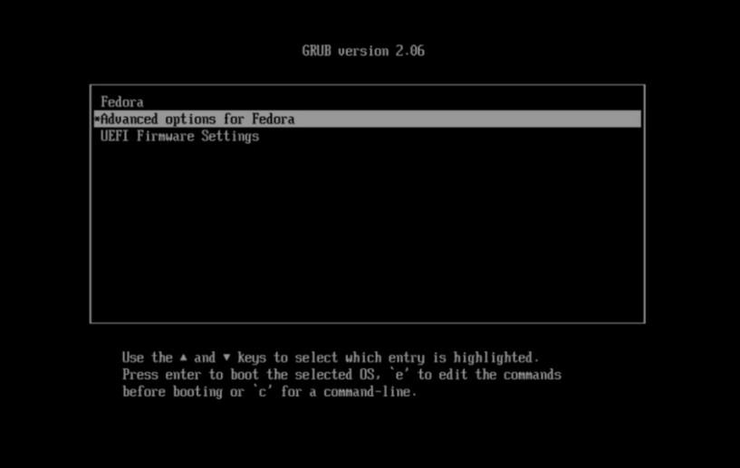
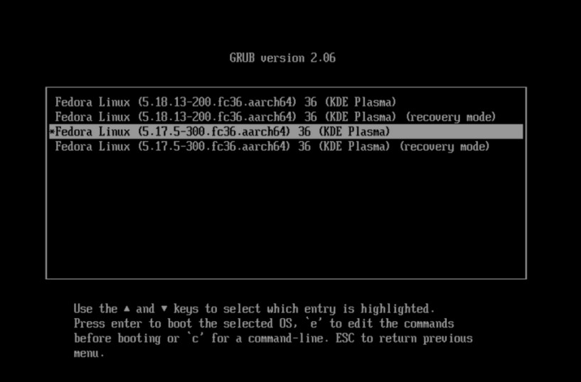
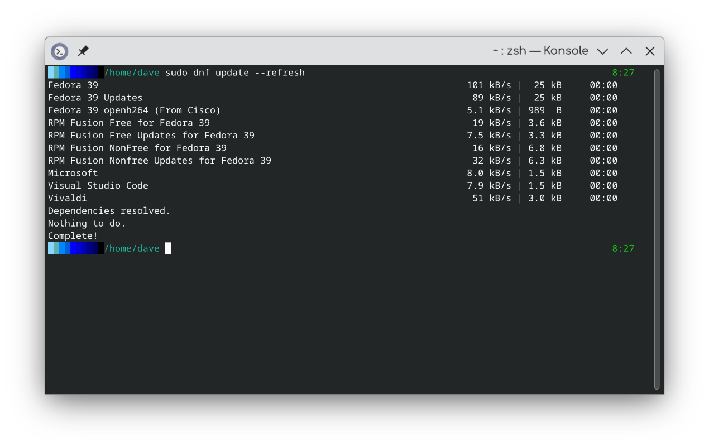

- [1) Introduction](#1-introduction)
- [2) Installation](#2-installation)
  - [X11 vs Wayland](#x11-vs-wayland)
- [3) Shells](#3-shells)
  - [Zsh](#zsh)
    - [Themes](#themes)
  - [Bash](#bash)
- [4) DNF](#4-dnf)
  - [DNF Options](#dnf-options)
  - [RPM Fusion](#rpm-fusion)
- [5) My Fedora KDE settings & tweaks](#5-my-fedora-kde-settings--tweaks)
  - [Changing The Volume Name](#changing-the-volume-name)
  - [Konsole](#konsole)
  - [Dolphin](#dolphin)
  - [KDE System Settings](#kde-system-settings)
    - [Startup/SDDM](#startupsddm)
    - [Appearance](#appearance)
    - [KDE Taskbar](#kde-taskbar)
  - [Laptop Power Management](#laptop-power-management)
  - [Multiple Desktops](#multiple-desktops)
    - [Pagers](#pagers)
- [6) Apps I'd Recommend](#6-apps-id-recommend)
  - [Yakuake](#yakuake)
  - [Visual Studio Code](#visual-studio-code)
    - [Using the Microsoft repository](#using-the-microsoft-repository)
    - [Using a Flatpak](#using-a-flatpak)
  - [Microsoft Open Fonts](#microsoft-open-fonts)
- [7) General Linux Information](#7-general-linux-information)
  - [SSH](#ssh)
  - [Backups](#backups)
  - [VPN](#vpn)
- [8) SELinux](#8-selinux)
- [9) Advanced Tweaking](#9-advanced-tweaking)
  - [Grub](#grub)
    - [Grub Menu Customization](#grub-menu-customization)
    - [Grub Configuration Files](#grub-configuration-files)
    - [Themes](#themes-1)
  - [Customizing the DNF repository list](#customizing-the-dnf-repository-list)
    - [Structure of a .repo file.](#structure-of-a-repo-file)
  - [Fedora inside Parallels on an M1](#fedora-inside-parallels-on-an-m1)
- [10) KDE Development](#10-kde-development)
<hr>
<a name="intro"></a>

# 1) Introduction

I've run Fedora since Fedora 9. It's my choice for a Linux OS for a number of reasons. When I first started with Linux my college used Scientific Linux, based on CentOS which itself is based on RedHat. Other students used Ubuntu, but I found it difficult to use since the development tools & other things don't match. Think Ubuntu's Build Essentials vs Fedora's Development Tools group. Everything I did on my machine matched what was used on the servers.  

Also, I just like the way Fedora does things. It may seem more complicated that Ubuntu but it gave me the opportunity to learn much more about what's happening inside. Linus Torvalis uses Fedora. The prosecution rests. :)

I've spent a lot of time just playing with Fedora and KDE, learning how it works. KDE is very configurable. You can pretty much set it up however you want. This is going to be a work in progress. As I find (or remember) more I'll add it. I hope it helps you. 


<hr>
<a name="install"></a>

# 2) Installation


* Download the Fedora KDE Spin [https://spins.fedoraproject.org/en/kde/](https://spins.fedoraproject.org/en/kde/)
<br>


* Import Fedora's GPG key(s) <br>
```bash
curl https://getfedora.org/static/fedora.gpg | gpg --import
```

* Verify the checksum is valid 
  
```bash
gpg --verify-files CHECKSUM_FILENAME
```
 * Verify the download's checksum matches 
```bash
sha256sum -c CHECKSUM_FILE
```

Unless I'm installing Fedora in a VM I ***always*** encrypt the drive. I use the standard install options and leave the root user disabled. Obviously if you need a specific partition layout set it up here. I'd be wary of playing with it for the sake of playing with it. The Fedora engineers have done a great job of optimizing everything for the desktop and it would be very easy to *optimize* your system so it runs worse. I used to make the swap partition larger but there was no need for it.

Fedora switched to the Btvfs file system from Ext4. I'd leave it alone. There are discussions/arguments all over the web about the problems & benefits of Btvfs but like for partitioning, you're best just to leave it alone.

The Fedora installer looks different depending on what Spin you're installing. For example, the KDE Spin has you setup the user account before installing while the standard Fedora installation (Gnome) has you creating the user after installing. I'm not sure why.

After installing Fedora you'll want to update everything before adding to your system. See the [DNF](#dnf) section for more information. 

```bash
sudo dnf update -y
```

The '-y' parameter suppresses the 'yes/no' prompts.

<a name="shells"></a>

## X11 vs Wayland

Wayland is the default display manager for the Fedora KDE spin. Here are the Fedora [Wayland](https://docs.fedoraproject.org/en-US/fedora/latest/system-administrators-guide/Wayland/) docs. 

I don't have any experience using KDE under Wayland. I tried it and had problems, but I'm running an ARM build of Fedora inside a VM on a M1 Macbook Air. Not really a fair test.

When I get to it, I'll try it on my old PC laptop (Ryzen 5) and add more here.


<hr>

# 3) Shells

I use **<code>exa</code>** to replace **<code>ls</code>**. See [https://github.com/ogham/exa](https://github.com/ogham/exa) for more information. It formats things really well. I don't know why the timestamps are so dark. There's no setting in exa that sets colors for columns. Might be somewhere in <code>LS_COLORS</code>.  

I love the octal file attributes and Git status.<br>
```bash
alias ls='exa -lah --group-directories-first -F --git --no-permissions --octal-permissions 
```
<br>


<a name="zsh"></a>

## Zsh
I'm starting to use zsh but still have Bash configured on my system. Zsh gives you a LOT of features over what Bash has. Read more at [https://zsh.sourceforge.io/Intro/intro_toc.html](https://zsh.sourceforge.io/Intro/intro_toc.html)

I also recommend Oh-My-Zsh. It adds lots of features that will make your life easier, along with themes. Check it out at [https://github.com/ohmyzsh/ohmyzsh](https://github.com/ohmyzsh/ohmyzsh)  

To install Oh-My-Zsh
```bash
sh -c "$(curl -fsSL https://raw.github.com/ohmyzsh/ohmyzsh/master/tools/install.sh)"
```

It will create <code>~/.oh-my-zsh</code> in your home directory. Themes are in <code>~/.oh-my-zsh/themes</code>.

<a name="zsh-themes"></a>

### Themes

Oh-My-Zsh has many themes you can try out. I took a theme and modified it to. Other than using an installed theme that's probably the easiest route. Theme building can get complicated.

[This page has a lot of information on zsh themes](https://github.com/ohmyzsh/ohmyzsh/wiki/Themes)

My theme is based on the nanotech.zshtheme found in <code>~/.oh-my.zsh/themes</code>.

```
  bar1() {    
      BAR_FG="048"    
      BAR1_BG="117  "  
      echo "%{$FG[$BAR_FG]%}%{$BG[$BAR1_BG]%} "    
  }    
  bar2() {    
      BAR_FG="048"    
      BAR1_BG="073"    
      echo "%{$FG[$BAR_FG]%}%{$BG[$BAR1_BG]%} "    
  }    
  bar3() {    
      BAR_FG="048"    
      BAR1_BG="033"    
      echo "%{$FG[$BAR_FG]%}%{$BG[$BAR1_BG]%} "    
  }    
  bar4() {    
      BAR_FG="048"    
      BAR1_BG="026"    
      echo "%{$FG[$BAR_FG]%}%{$BG[$BAR1_BG]%} "    
  }    
  bar5() {    
      BAR_FG="048"    
      BAR1_BG="021"    
      echo "%{$FG[$BAR_FG]%}%{$BG[$BAR1_BG]%} "    
  }    
  bar6() {    
      BAR_FG="048"    
      BAR1_BG="020"    
      echo "%{$FG[$BAR_FG]%}%{$BG[$BAR1_BG]%} "
  } 
  bar7() {    
      BAR_FG="048"    
      BAR1_BG="019"    
      echo "%{$FG[$BAR_FG]%}%{$BG[$BAR1_BG]%} "    
  }    
  bar8() {    
      BAR_FG="048"    
      BAR1_BG="018"    
      echo "%{$FG[$BAR_FG]%}%{$BG[$BAR1_BG]%} "    
  }    
  bar9() {    
      BAR_FG="048"    
      BAR1_BG="017"    
      echo "%{$FG[$BAR_FG]%}%{$BG[$BAR1_BG]%} "    
  }    
  bar10() {    
      BAR_FG="048"    
      BAR1_BG="016"    
      echo "%{$FG[$BAR_FG]%}%{$BG[$BAR1_BG]%} "    
  }    

  COLOR_BAR="$(bar1)$(bar2)$(bar3)$(bar4)$(bar5)$(bar6)$(bar7)$(bar8)$(bar9)$(bar10)"**  

  PROMPT='${COLOR_BAR}%d %F{green}%F{yellow}%f**'  
  RPROMPT='$(git_prompt_info) %F{green}%D{%L:%M}** '  
  
  ZSH_THEME_GIT_PROMPT_PREFIX="%B%F{green}"     
  ZSH_THEME_GIT_PROMPT_SUFFIX="%f"    
  ZSH_THEME_GIT_PROMPT_DIRTY=" %F{red}*%f"    
  ZSH_THEME_GIT_PROMPT_CLEAN=""    

```
And looks like this


<a name="bash"></a>

## Bash

Here's the prompt for my colored bar in Bash

```
# Definitions for the color variant bar in the prompt. Doesn't have anything for Git.<br>

  BAR1="\\[\e[48;5;117m\] "  
  BAR2="\\[\e[48;5;73m\] "  
  BAR3="\\[\e[48;5;33m\] "  
  BAR4="\\[\e[48;5;26m\] "  
  BAR5="\\[\e[48;5;21m\] "  
  BAR6="\\[\e[48;5;20m\] "  
  BAR7="\\[\e[48;5;19m\] "  
  BAR8="\\[\e[48;5;18m\] "  
  BAR9="\\[\e[48;5;17m\] "  
  BAR10="\\[\e[48;5;16m\] " 
  CLEAR="\\[\e[0m\]" 
  GREEN="\\[\e[1;32m\]" 
  YELLOW="\\[\e[1;33m\]" 
  PURPLE="\\[\e[1;35m\]" 

  # I removed the code to set the titlebar.  I'm good w/it just saying 'Konsole' or whatever  
  PS1="${BAR1}${BAR2}${BAR3}${BAR4}${BAR5}${BAR6}${BAR7}${BAR8}${BAR9}${BAR10}${CLEAR}${YELLOW}\${PWD} ${GREEN}\$ ${CLEAR}"  

```
and looks like this. 


<hr>


<a name="dnf"></a>

# 4) DNF
<a name="dnf-config"></a>

## DNF Options

There are many options for DNF from getting through proxies, security settings, and more. Look at the official [Fedora DNF Reference](https://docs.fedoraproject.org/en-US/fedora/latest/system-administrators-guide/package-management/DNF/), the [Fedora DNF Quickdocs](https://docs.fedoraproject.org/en-US/quick-docs/dnf/) and the [DNF GitHub page](https://github.com/rpm-software-management/dnf) for more information.

I use one option for dnf, set in <code>/etc/dnf/dnf.conf</code>.

```
fastestmirror=1  # The default setting is off. If you have problems after setting this revert back.
```

I also use the -y parameter to suppress the 'Are you sure' messages.<br>

```
sudo dnf -y update
```
You can set this in <code>/etc/dnf/dnf.conf</code> by using <code>assumeyes=1</code> but I'd advise against it. I use -y for running updates but not to install individual packages so I can see what's actually getting installed.


DNF can take a long to update itself because it downloads the repository data often. A [discussion](https://ask.fedoraproject.org/t/why-is-dnf-so-slow/6316) on the Fedora Project site suggested setting <code>metadata_expire=2d</code> in <code>/etc/dnf/dnf.conf</code>. If you use the -q parameter (quiet) like in my install scripts it will look like the process hangs. 

There are a lot of dnf groups to choose from. See a list of groups by running 
```
dnf group list
```

You can see what's in each group by running <code>dnf group info GROUP_NAME</code> I generally install *Development Tools*, *Development Libraries* and *X Software Development* but take a look at the ones that sound like they might fit your needs. 
 
 
 Groups are by far the easiest way to install the big desktop environments. For example, if for some unknown reason you wanted to install Gnome you'd use
```
sudo dnf group install "GNOME Desktop Environment
```

(IMHO Gnome looks like what you'd get if Crayola wrote a window manager :sunglasses: )

Smaller DE's are just installed as packages; e.g. 
```
sudo dnf install fluxbox
```

<a name="rpmfusion"></a>

## RPM Fusion
You'll probably want to enable RPM Fusion. RPM Fusion is a repository that contains software that doesn't meet the Fedora licensing. The base Fedora distro is FOSS-Only.

[RPM Fusion Site](https://rpmfusion.org)

You can install it from your browser but I think it's easier to do it from the command line.

```
sudo dnf install https://mirrors.rpmfusion.org/free/fedora/rpmfusion-free-release-$(rpm -E %fedora).noarch.rpm https://mirrors.rpmfusion.org/nonfree/fedora/rpmfusion-nonfree-release-$(rpm -E %fedora).noarch.rpm
```

Installing the appstream packages with dnf will enable showing apps from those repos in Discover.
```
appstream
appstream-qt
rpmfusion-free-appstream-data
rpmfusion-nonfree-appstream-data
```

Many of the options in dnf are actually plugins. You can install additional plugins, like the one you'll need for updating Fedora itself. See the plugins section at [https://docs.fedoraproject.org/en-US/quick-docs/dnf/](https://docs.fedoraproject.org/en-US/quick-docs/dnf/)

If you want something other than what's in the Fedora & RPM Fusion repos, check out Fedora's COPR repositories. They're user-created repos with their projects. There are nightly builds of software as well. Some of them are personal repos and say 'do not use'. Don't use them. :)

[https://copr.fedorainfracloud.org/coprs/](https://copr.fedorainfracloud.org/coprs/)

<hr>

<a name="various-kde-settings"></a>

# 5) My Fedora KDE settings & tweaks

<a name="change-volume-name"></a>

## Changing The Volume Name

Launch KDE Disk Editor from the Live CD. Rename your home volume to whatever you want. You can't change the name of a volume when booting from it.

<a name="konsole"></a>

## Konsole

* General - Uncheck 'Remember window size'
* Profiles - You can't edit the Default profile so create a new one. I use a 90x24 window size. Under Command change it to /bin/zsh. Konsole will use the shell specified here and *not* the default shell for your account
* Under Appearance, I use White on Black, then press Edit and change Background transparency to 10%. I also bump the font up a bit.
* Scrolling to Unlimited


Set your new profile to the default profile. Then I disable all of toolbars under the Konsole Settings menu and hide the Menubar.

<a name="dolphin"></a>

## Dolphin
I remove all of the 'search for' categories on the left. I also hide the boot partition. Then I add what I need to 'Places'.

I setup Dolphin like this: In Settings<br>
* General/Behavior - Remember display style for each folder. This is handy for making the icons larger in folders with images, etc.
* General/Previews - Select the types you want displayed. I generally turn off everything but images & ebooks
* Context Menu - take everything out I don't need or want. There are additional services you can download. 


<a name="system-settings"></a>

## KDE System Settings
<a name="sddm"></a>

### Startup/SDDM
I set it to automatically log in. Yes, I know this is bad security but if you set the machine up with an encrypted drive you have to login with that before continuing. I don't worry about it on a VM either. Obviously if this machine might be at risk don't do this. I use mine for playing around and learning about Fedora. 

<a name="appearance"></a>

### Appearance

* Icons - Miya (download from the Icons dialog)
* Colors - Nord Light (download from the Colors dialog)
* Fonts - Comfortaa
* Plasma Style - Oxygen
* Window Decorations - Breeze, but I change the window title so it's on the right.
* Splash Screen - Breeze

The KDE Store [https://store.kde.org](https://store.kde.org) has a complete list of Plasma widgets, fonts, colors, themes and other addons.
<a name="taskbar"></a>

### KDE Taskbar
* Change menu to Application Menu<br>
* Application Menu Settings, check 'Flatten submenus' and uncheck Recent categories<br>
* Install Latte Seperator<br>
* Add another digital clock & set it to UTC<br>
* Use QuickLaunches to group applications<br>
* Use Latte Seperator to put nice seperators between the QuickLaunches, clocks, etc.<br>

Once it's done it looks like this


<br>

<a name="power"></a>

## Laptop Power Management

It's easiest to do it in the settings app, but if you want to do it
from the command line install tlp, then you can set power management this way<br>

```
cpupower frequency-set --governor conservative
```
Read the man page for cpupower for more options

<a name="desktops"></a>
## Multiple Desktops

KDE, like most desktop environments will use multiple desktops. Set them up in Settings/Workspace Behavior/Virtual desktops.

There are some great transitions available where your desktops can slide over one another and that sort of thing. Those are in Desktop Effects.

If you wanted the spinning cube, however, they removed it. The code wasn't compatible with the way the KDE team is setting up the rest of the system. Hopefully it will come back. 

<a name="pagers"></a>
### Pagers
KDE comes with a basic pager Plasmoid that works, but I think it takes up too much space on the toolbar, especially when you have 4 or more desktops configured. I use Virtual Desktop Bar. [https://github.com/wsdfhjxc/virtual-desktop-bar](https://github.com/wsdfhjxc/virtual-desktop-bar) It has many options to configure the pager.

<hr>
<a name="other-apps"></a>

# 6) Apps I'd Recommend

A list of other applications can be found at [https://apps.kde.org](https://apps.kde.org) but these are the ones I use the most.

<a name="yakuake"></a>

## Yakuake
Yakuake is a great drop-down terminal. You hit a hotkey and a terminal drops down from the top of the screen. It's themeable and new themes can be downloaded.


<br>

See at [https://apps.kde.org/yakuake/])https://apps.kde.org/yakuake/) or install with dnf. 
```
sudo dnf install yakuake
```


<a name="vscode"></a>

## Visual Studio Code

<a name="vscode-repo"></a>

### Using the Microsoft repository

At this point (Fedora 36) VSCode isn't in the Fedora or RPM Fusion repositories. You can download it but I like having it installed from a repo so it stays up to date.

This will install the repo and key
```

sudo rpm --import https://packages.microsoft.com/keys/microsoft.asc

sudo sh -c 'echo -e "[code]\nname=Visual Studio Code\nbaseurl=https://packages.microsoft.com/yumrepos/vscode\nenabled=1\ngpgcheck=1\ngpgkey=https://packages.microsoft.com/keys/microsoft.asc" > /etc/yum.repos.d/vscode.repo'
```

Then<br>
```
dnf check-update 
sudo dnf install code
```

<a name="vscode-flatpak"></a>

### Using a Flatpak
If you prefer Flatpaks<br>
```
flatpak install https://flathub.org/repo/appstream/com.visualstudio.code.flatpakref
```

See [https://code.visualstudio.com/docs/setup/linux](https://code.visualstudio.com/docs/setup/linux) or their GitHub page [Microsoft's Visual Studio Code GitHub page](https://github.com/Microsoft/vscode) for more information.


<a name="microsoft-open-fonts"></a>

## Microsoft Open Fonts

If you get documents created in Microsoft Word and open them in LibreOffice sometimes you'll get strange font conversions. The program will use the font listed in the
document unless it doesn't have it installed. Then it will *try* to find something compatible.

You can install the Microsoft open fonts that will take care of most of this. They're on SourceForge

```
rpm -i --quiet https://downloads.sourceforge.net/project/mscorefonts2/rpms/msttcore-fonts-installer-2.6-1.noarch.rpm 
```

You'll need <code>cabextract</code> and <code>xorg-x11-font-utils</code> to install the fonts.

<hr>
<a name="linux"></a>

# 7) General Linux Information

## SSH
I've created my private and public keys but the correct permissions are easy to forget. Just use <code>chmod <permissions> filename/directory</code>

```
SSH directory 700
Private key   600
Public key    644

ex: chmod 600 id_rsa
```
## Backups
***Always*** do backups. Have more than one if possible. It can be as simple and copying everything to an external USB drive to using a tool like rsync. Here's a good list of suggestions. 

[https://linuxhint.com/11_best_backup_tools_linux/](https://linuxhint.com/11_best_backup_tools_linux/)

## VPN
I use NordVPN on Windows, MacOS and Linux. For info, see [https://nordvpn.com/download/linux/](https://nordvpn.com/download/linux/). Select 'install the rpm package'.

I ran into some strange problems using their NordLynx protocol so I switched to OpenVPN. That fixed everything.
<hr>

<a name="selinux"></a>

# 8) SELinux
There are people out there who recommend disabling SELinux when alerts start popping up. ***Please*** don't do that. SELinux is a powerful security tool. SELinux runs in three modes: *disabled*, *permissive* & *enforcing*. If you install <code>setroubleshoot</code> (I recommend it) it will give you a detail description of what the problem is. If you get an SELinux alert something is trying to write where it doesn't have permission. If the app should be able to write there you can tell SELinux to allow that app to access that file.

Here is a good overview of SELinux for Fedora.
[https://docs.fedoraproject.org/en-US/quick-docs/getting-started-with-selinux/](https://docs.fedoraproject.org/en-US/quick-docs/getting-started-with-selinux/)

If an app is trying to write where it shouldn't that's a problem for the developer or package maintainer to fix but you can use a policy to fix it for now.
<hr>
<a name = "advanced"></a>

# 9) Advanced Tweaking

<a name="grub"></a>

## Grub
<a name="grub-config"></a>

### Grub Menu Customization

The main config file is <code>/etc/default/grub.</code> I set mine up with these differences.<br>

I add/change these lines to the grub config file
```
GRUB_THEME=/boot/grub2/themes/poly-dark/theme.txt 

# The wording is a bit strange, but disabling this will enable the
# submenu on the Grub menu. It puts the other kernels into the submenu
# cleaning up your menu.
GRUB_DISABLE_SUBMENU=false 

# I recommend disabling this. The Recovery options are always
# a good idea to have. Plus if you enable the submenu Grub puts
# them all there.   
GRUB_DISABLE_RECOVERY=false  

# The default menu item when Grub starts
GRUB_DEFAULT=0   

# Sets the resolution of the Grub screen if you're using graphics
GRUB_GFXMODE=auto  
```

This will set your grub options. To save changes and write the Grub menu to disk. If you're running an UEFI run
```
sudo grub2-mkconfig -o /boot/efi/EFI/fedora/grub.cfg
```
For legacy systems run
```
sudo grub2-mkconfig -o /boot/grub2/grub.cfg
```
You can edit grub.cfg directly for testing, but it will work until grub2-mkconfig overwrites it.

<a name="custom-grub"></a>

### Grub Configuration Files

The Grub menu is built from config files in <code>/etc/grub.d</code>. You'll need root privileges; sudo doesn't work very well so enable the root account, shell into it, make the changes you want, then log out and disable the root user.

There is a file that adds other OSs, like Windows. That's in <code>30_os-prober</code>. Open it and find the <code>menuentry</code> immediately after searching for 'Windows' and change the first part to <code>menuentry '$(echo "Windows")'</code>Make sure you get that last single quote. This way it just says 'Windows' and not all the stuff about what partition it's on.

Or, you could change it to read 'Windoze, 'Help me God' or whatever you'd like :)

This is what it looks like with the above options without the theme.


<br>

<a name="grub-themes"></a>

### Themes
You can download Grub themes from gnome-look.org or the KDE store. Depending on your monitor and/or resolution you may want to change the font sizes. *Note: I have not been able to get Grub themes to work in a VM.*

[Here's a good article explaining how to do it](https://www.bleepingcomputer.com/forums/t/743402/how-to-change-font-size-in-grub-menu/)<br>
[There are some nice Grub themes here](https://www.gnome-look.org/browse?cat=109)


<a name="custom-repo-list"></a>

## Customizing the DNF repository list

### Structure of a .repo file.
Fedora's repository files are located in <code>/etc/yum.repos.d</code>. This is a section of a .repo. There can be other sections, like for debug or source packages. These are usually disabled.

```
[fedora]
name=Fedora $releasever - $basearch
metalink=https://mirrors.fedoraproject.org/metalink?repo=fedora-$releasever&arch=$basearch
enabled=1
countme=1
metadata_expire=7d
repo_gpgcheck=0
type=rpm
gpgcheck=1
gpgkey=file:///etc/pki/rpm-gpg/RPM-GPG-KEY-fedora-$releasever-$basearch
skip_if_unavailable=False
```

Fedora's Repository Docs are here - [https://docs.fedoraproject.org/en-US/quick-docs/repositories/](https://docs.fedoraproject.org/en-US/quick-docs/repositories/)


To change what the repo looks like when running dnf change the 2nd line of the .repo file.

The entries will look like this

```
name=Fedora $releasever - $basearch
```
<br>
You can change them to something like this so the repo names and architechure are in columns.  

```
Fedora $releasever              - $basearch
name=Fedora $releasever Updates - $basearch
```

If you want them in order, rename each repo file; e.g.

```
01-Fedora.repo 
02-Fedora-updates.repo
```
to make it look like this


<br>

<a name="parallels"></a>

## Fedora inside Parallels on an M1

I run Fedora now in a VM on my MacBook. I do development mainly in Swift but still enjoy learning more about Fedora.  

There is a problem with the Parallels tools running inside Parallels on an M1 Mac. It looks like running with Linux kernel 5.18.13-200 causes the tools & integration to fail, but running 5.17.5-300 it works fine. 

I'm waiting to see if a kernel or software update fixes it.

<hr>
<a name="kdedev"></a>

# 10) KDE Development

I usually start off with the 
dnf groups <code>"Development Tools"</code> <code>"Development Libraries"</code>**, and <code>"X Software Development"</code>. Then install the list of packages in <code>setup-install-kdelibs.txt</code>. That gets you pretty close. Then you need to get the product source from KDE and create a build environment.
```
mkdir -p ~/kde/src
git clone https://invent.kde.org/sdk/kdesrc-build.git
cd kdesrc-build
./kdesrc-build --initial-setup
source ~/.bashrc
sudo dnf -y install builddep plasma-desktop plasma-workspace kwin
```

Obviously, if you're using zsh change your <code>.zshrc</code> accordingly.

If you're interested in working on KDE itself check out the Fedora KDE SIG
at [https://fedoraproject.org/wiki/SIGs/KDE](https://fedoraproject.org/wiki/SIGs/KDE)<br><br>
